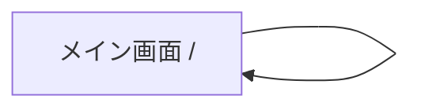

# UI 仕様

## 画面一覧

| 画面名 | パス | コンポーネント |
|--------|------|---------------|
| メイン画面 | `/` | `Home`（page.tsx） |

## 画面遷移図

単一画面アプリのため画面遷移なし。

## 画面機能仕様

### メイン画面

#### ファイル入力エリア

- ファイル選択 input（`accept="application/pdf"`, `multiple`）
- ドラッグ＆ドロップ対応エリア（フォーム全体）
- ドラッグ中はオーバーレイで「ここに PDF をドロップ」を表示
- 「PDF を結合する」ボタン（2 ページ未満 or 結合中は disabled）

#### 結合結果セクション

- 結合完了時に表示（緑枠）
- ダウンロードリンク（`merged.pdf`）
- 結合済み PDF の iframe プレビュー

#### ページ一覧セクション

- ページ数の見出し表示
- 各ページを `PageItem` コンポーネントで表示

### 表示状態

| 状態 | 表示内容 |
|------|---------|
| Loading | 結合ボタンが「結合中...」に変化し disabled |
| Empty | ページ一覧・結合結果セクションが非表示 |
| Error | ファイル入力エリア下部に赤文字でエラーメッセージ |

## レイアウト構成

- 中央揃え 1 カラムレイアウト（`max-w-xl` / `max-w-6xl`）
- ヘッダー: タイトル + 説明文
- メイン: ファイル入力 → 結合結果 → ページ一覧（縦積み）
- フッター: コピーライト

## コンポーネント一覧

| コンポーネント | ファイル | 概要 |
|---------------|---------|------|
| `Home` | `src/app/page.tsx` | メイン画面（ファイル入力・D&D・結合操作） |
| `PageItem` | `src/app/components/PageItem.tsx` | 個別ページの表示・操作 UI（プレビュー・回転・移動・削除） |

## UI 規約

- スタイリング: Tailwind CSS v4（ユーティリティクラス直書き）
- ダークモード: `dark:` プレフィクスで対応
- ボタン: `rounded border` ベース、操作系は `border-neutral-300`、削除は `border-red-300`
- 状態フィードバック: disabled 時は `opacity-50` + `cursor-not-allowed`
