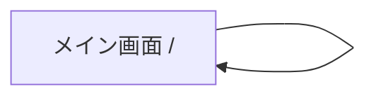

# UI 仕様

> 具体的なスタイル値（Tailwind クラス・色コード・角丸・影）およびコンポーネントの構成はコードと `globals.css` を source of truth とする。本書は画面の意図・表示状態・UI 規約（契約）を扱う。

## 画面一覧

| 画面名 | パス | 概要 |
|--------|------|------|
| メイン画面 | `/` | PDF アップロード・ページ管理・結合・ダウンロードを 1 画面で提供 |

単一画面アプリのため画面遷移はない。

## 画面機能仕様

### ファイル入力

- ファイル選択（`accept="application/pdf"`、複数選択可）とフォーム全体でのドラッグ&ドロップに対応する。
- ドラッグ中はオーバーレイで投下先を明示する。
- PDF 以外のファイルは無視する（エラーにしない）。

### ページ管理

- アップロードした PDF をページ単位に分解し、各ページをプレビュー付きで一覧表示する。
- 各ページに対し、上下移動・削除・時計回り/反時計回りの 90° 回転を提供する。
- ドラッグ&ドロップによるページ並び替えに対応する。
- 先頭ページの「上へ」・末尾ページの「下へ」は無効化する。

### 結合・出力

- 2 ページ以上で結合を実行可能にする（1 ページ以下は結合ボタンを無効化）。
- 結合完了後、プレビューとダウンロードリンクを表示する。
- 出力ファイル名はユーザーが指定できる（未指定時の既定値は実装を参照）。

## 表示状態（契約）

| 状態 | 表示内容 |
|------|---------|
| Loading | 結合処理中は結合ボタンを処理中表示に切り替え、無効化する |
| Empty | ページ未追加時はページ一覧・結合結果セクションを表示しない |
| Error | 処理失敗時はユーザーフレンドリーなエラーメッセージを表示する |

## レイアウト方針

- 中央揃えの 1 カラム構成。
- ヘッダー（タイトル + 説明）／メイン（ファイル入力 → 結合結果 → ページ一覧の縦積み）／フッター。

## UI 規約

- **デザイン仕様**: [カゴメ DESIGN.md](https://github.com/kzhrknt/awesome-design-md-jp/blob/main/design-md/kagome/DESIGN.md) に準拠する。ブランドカラー・タイポグラフィ・ボタン/カード形状はこの仕様に従う。具体値は `globals.css` を source of truth とする。
- **スタイリング**: Tailwind CSS のユーティリティクラスを直書きする。
- **ボタン**: ピル形状の CTA を基本とする。
- **状態フィードバック**: 無効化時は視覚的に非活性であることを明示する（淡色 + 操作不可カーソル）。
- **ダークモード**: **非対応**（カゴメ仕様に準拠）。`prefers-color-scheme` による切り替えは行わない。
